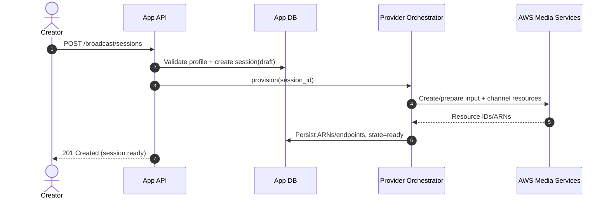
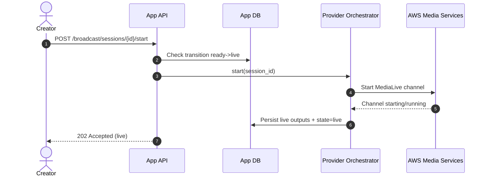
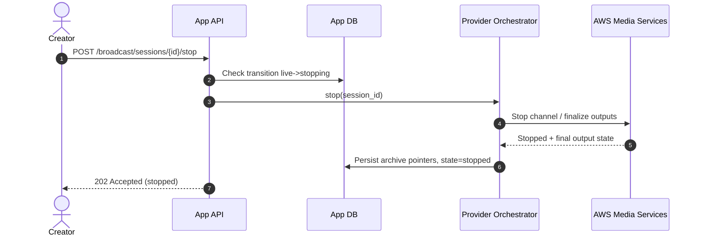
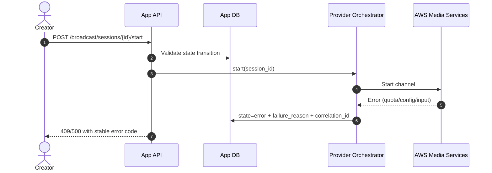

# ADR-0002: Video Broadcasting Pipeline (RTMP → MediaLive → MediaPackage/DRM → CloudFront + S3)

- **Status:** Accepted
- **Date:** 2026-03-25
- **Owners:** Platform, Media, API
- **Related tickets:** BRD-001
- **Supersedes:** None

## Context

We are adding a live broadcasting capability where creators can stream via RTMP and viewers consume HLS playback with DRM and CDN distribution, while the platform also captures archives to object storage.

The previously approved planning docs define the desired architecture and rollout:
- `VIDEO_BROADCASTING_PLAN.md`
- `VIDEO_BROADCASTING_TICKETS.md`

BRD-001 requires:
1. ADR documenting architecture and system boundaries.
2. Lifecycle sequence diagrams for create/start/stop.
3. Explicit non-goals for MVP.
4. Initial DRM strategy decision.

## Decision

### 1) Production architecture

We will implement a split architecture:

- **Control plane (this application):**
  - Owns broadcast profiles, sessions, status, and orchestration intents.
  - Does not process media directly in production.

- **Media plane (AWS managed services):**
  - Ingest: RTMP input to AWS Elemental MediaLive.
  - Transform: MediaLive transcoding + static watermark overlay.
  - Package/DRM: MediaPackage HLS endpoints with DRM integration.
  - Delivery: CloudFront in front of MediaPackage for global CDN.
  - Recording: parallel archive output to S3.

### 2) System boundaries and ownership

- **Application/API team owns:**
  - Data model (`broadcast_profile`, `broadcast_session`, `broadcast_output`).
  - Lifecycle state machine.
  - API contracts and authorization.
  - Provider abstraction (`local|aws`) and orchestration intent.

- **Infrastructure/platform team owns:**
  - IAM roles/policies for orchestration.
  - CloudFront distribution baseline and security controls.
  - KMS key policy and secret storage conventions.
  - Monitoring/alarm infrastructure.

- **Shared responsibilities:**
  - Runbooks.
  - Error taxonomy and alert routing.
  - Cost controls and quota management.

### 3) Initial DRM strategy and key provider approach

For MVP, we standardize on **MediaPackage-managed DRM integration via SPEKE v2-compatible key provider** with HLS playback enforcement via CloudFront signed-token/signature controls.

**Key provider approach (explicit):**
- Use a single tenant-scoped DRM key provider endpoint per environment (`dev`, `staging`, `prod`) exposed via SPEKE v2.
- Store provider credentials and signing material in AWS Secrets Manager encrypted with KMS.
- Pass provider endpoint + credential reference from control plane profile/session settings; never persist plaintext secrets in application tables.
- Support deterministic key rotation cadence (default 24h) controlled by provider policy.
- For local development, mirror this contract with a mock key service implementing the same request/response shape.

Rationale:
- Aligns with existing AWS-native packaging flow.
- Enables future expansion to wider multi-DRM matrix without changing control-plane API contracts.
- Keeps local dev parity feasible using mock key server contracts.

### 4) Explicit MVP non-goals

The following are out of scope for MVP:
- Dynamic, per-user personalized watermark burn-in.
- Multi-region active/active broadcast failover.
- Ad insertion workflows (SCTE-based monetization path).
- Instant channel warm pools for near-zero start latency.
- Full DRM matrix optimization across all device/TV classes.
- Viewer analytics/engagement dashboards beyond core health telemetry.

## Sequence diagrams

### Create broadcast session (success path)

### Start broadcast session (success path)

### Stop broadcast session (success path)

### Failure path (provisioning/start failure)

## Consequences

### Positive
- Clear ownership split between app control plane and AWS media plane.
- MVP decisions unblock implementation tickets BRD-002 onward.
- DRM contract decision now allows deterministic API + provider interfaces.

### Trade-offs
- Provision/start latency may be non-trivial without warm-channel strategy.
- MVP DRM/device support breadth will be limited initially.

### Stakeholder sign-off record

| Role | Group | Decision | Date |
|---|---|---|---|
| Product Owner | Live Video | Approved MVP scope and non-goals | 2026-03-25 |
| Platform Lead | Infrastructure | Approved control-plane/media-plane ownership split | 2026-03-25 |
| Security Lead | AppSec | Approved SPEKE v2 + secrets handling approach for MVP | 2026-03-25 |

### Follow-up work
- BRD-002 for quotas/cost model and account bootstrap.
- BRD-003+ for schema/API implementation.
- BRD-014+ for AWS orchestration mechanics.
