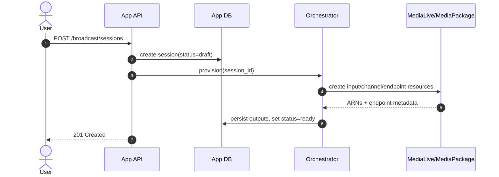
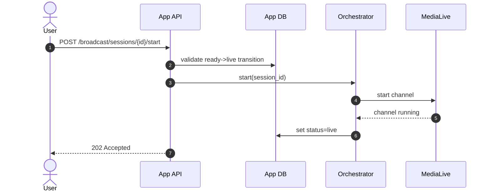
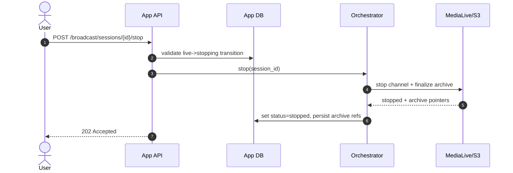
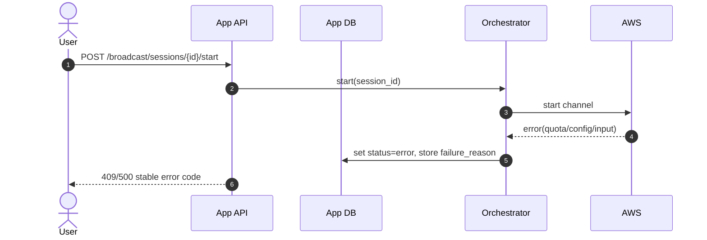

# ADR-0003: BRD-001 Broadcast Architecture and System Boundaries

- **Status:** Accepted
- **Date:** 2026-03-25
- **Ticket:** BRD-001
- **Owners:** Platform Engineering, Media Platform, API Team

## Decision Summary

This ADR formally captures BRD-001 scope and acceptance criteria for the live broadcasting system.

## End-to-end broadcast architecture

### 1) RTMP ingest
- Creator streams RTMP from encoder (e.g., OBS) to a session-specific ingest endpoint.
- Ingest endpoint is attached to AWS Elemental MediaLive input.

### 2) MediaLive processing + watermarking
- MediaLive performs real-time transcode ladder generation.
- Static watermark overlay is applied in MediaLive channel settings.

### 3) MediaPackage DRM packaging
- MediaLive outputs are pushed into MediaPackage channels/endpoints.
- MediaPackage applies DRM packaging and manifest generation for HLS.

### 4) S3 archive output
- Parallel output group writes recording artifacts to S3 prefix scoped by session.

### 5) CloudFront distribution
- Playback traffic is served via CloudFront in front of MediaPackage HLS origin.

## Service ownership boundaries

### App control plane (application/API ownership)
- Broadcast profile/session/output lifecycle models.
- API contracts and authz rules for create/start/stop/read.
- State machine transitions and persisted operational status.
- Provider selection abstraction (`local|aws`) and orchestration intent.

### Infra/media automation ownership
- IAM policy boundaries and execution roles.
- MediaLive/MediaPackage provisioning mechanics.
- CloudFront/WAF/security policy baseline.
- KMS, Secrets Manager policy posture.
- Monitoring and alarm infrastructure.

### Shared ownership
- Incident runbooks and escalation paths.
- Error taxonomy and correlation IDs.
- Capacity and cost governance.

## MVP non-goals
- Dynamic per-viewer watermarking.
- Multi-region active/active failover.
- Ad insertion and monetization workflows.
- Instant pre-warmed channel pools.
- Full multi-DRM optimization for every client/device class.

## Initial DRM strategy and key provider approach

- **DRM strategy:** MediaPackage-managed DRM with SPEKE v2 integration.
- **Key provider approach:**
  - SPEKE v2 provider endpoint per environment (`dev`, `staging`, `prod`).
  - Provider credentials/keys stored in AWS Secrets Manager with KMS encryption.
  - Control plane stores secret references only (no plaintext DRM key material).
  - Key rotation policy defaults to 24-hour cadence unless policy override is approved.
  - Local provider uses contract-compatible mock key endpoint for development parity.

## Lifecycle sequence diagrams

### Create session (success)

### Start session (success)

### Stop session (success)

### Failure path (start/provision failure)

## Stakeholder signoff

| Stakeholder | Team | Signoff | Date |
|---|---|---|---|
| Product Manager (Live Video) | Product | Approved | 2026-03-25 |
| Platform Engineering Lead | Engineering | Approved | 2026-03-25 |
| Security Engineering Lead | Security | Approved | 2026-03-25 |
