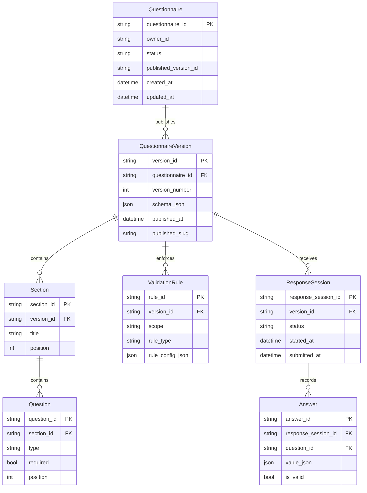

# Architecture Overview

This service is a FastAPI backend for security workflows (sessions, MFA, alerts) and billing, with a static control panel UI served from the root path.

## High-level components
- **API layer**: FastAPI routers under `app/routers/` expose REST endpoints for sessions, MFA, alerts, billing, and account/profile workflows.
- **Service layer**: shared business logic lives in `app/services/` and encapsulates DynamoDB access, billing helpers, and integrations.
- **Data layer**: DynamoDB tables store sessions, MFA devices, recovery codes, alerts, API keys, and billing artifacts.
- **Static UI**: `app/static/` hosts a control panel used for internal operations and testing.

## Request flow (typical)
1. Client calls an API endpoint (e.g., `/api/ui/session/start`, `/api/billing/charge-once`).
2. The router validates auth/session dependencies (see `app/auth/deps.py` and `app/services/sessions.py`).
3. Business logic executes in the service layer, reading/writing DynamoDB rows.
4. Responses return JSON for the UI or clients.

## Billing architecture
- **Stripe**: Uses setup intents, payment methods, and webhooks (`/api/stripe/webhook`) to sync payment state.
- **PayPal**: Exchanges setup tokens, captures orders, and reconciles via `/api/paypal/webhook`.
- **CCBill**: Tokenizes cards via the Advanced Widget and reconciles via `/api/ccbill/webhook`.
- **Ledger model**: Billing transactions are recorded in the DynamoDB billing table using ledger entries plus payment records.

## Questionnaire data model (QNR-001 ERD)
The questionnaire feature uses a single DynamoDB table (`questionnaires`) with typed entities and indexed access paths.

### Access/index strategy
- Owner lookup index: list questionnaires by creator.
- Questionnaire status index: list drafts/published/archived.
- Published lookup index: resolve published questionnaire schema by slug.
- Response status index: monitor in-progress/submitted response sessions.

These indexes are created in local bootstrap (`scripts/local-ddb-init.py`) and migration tooling (`scripts/migrations/20260302_questionnaire_schema.py`).

## Observability and metrics
The service exposes Prometheus-style metrics via `app/metrics.py` (if enabled), tracking request counts, latency, and sizes.

## Deployment topology
Deploy behind an HTTPS-terminating load balancer/ingress. The app expects AWS credentials for DynamoDB and optional KMS/SES integrations.
