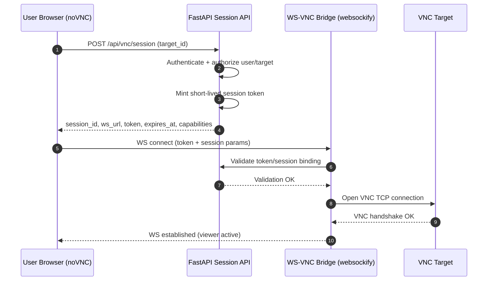
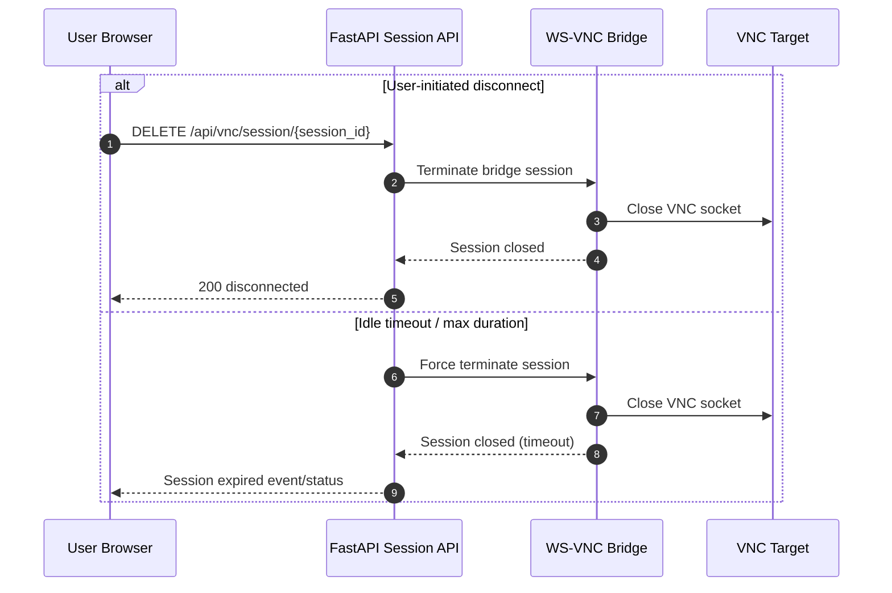

# ADR: noVNC Browser Session Architecture (VNC-001)

- **Status:** Proposed (pending Engineering + Security approval)
- **Date:** 2026-03-03
- **Owners:** Platform Engineering, Security Engineering
- **Related docs:**
  - `docs/novnc-browser-widget-plan.md`
  - `docs/novnc-browser-widget-implementation-tickets.md`

## 1) Context
We need a browser-native remote desktop experience using noVNC that allows authenticated users to start VNC sessions from the web UI. The solution must support strict authorization, short-lived credentials, and operational visibility while minimizing direct exposure of infrastructure targets.

## 2) Decision Summary
Adopt a **brokered three-hop architecture**:

1. Browser noVNC client
2. Backend session API (authZ + token minting + capability resolution)
3. WebSocket-to-VNC bridge (`websockify` or equivalent) connected to target VNC endpoint

### Key decision outcomes
- **Bridge placement:** Run bridge service in backend-controlled network segments (same trust zone as API workers or dedicated bridge tier).
- **Scale model:** Horizontal bridge scale-out behind load balancing with stateless control-plane APIs and per-session runtime state.
- **Target selection policy:** **Disallow arbitrary user-entered host/port in production**. Require target selection from an approved inventory/registration source. (Dev mode may allow explicit host/port with feature flag.)

## 3) Trust Boundaries and Data Flow

### Trust boundaries
- **Boundary A (Browser ↔ API):** Authenticated user requests session bootstrap.
- **Boundary B (API ↔ Bridge):** Internal service-to-service control of bridge lifecycle and connect params.
- **Boundary C (Bridge ↔ VNC target):** Runtime transport to remote desktop host.

### Data flow
1. User authenticates to web app and requests session for approved target.
2. API authorizes user→target access and mints short-lived connect token.
3. API returns `session_id`, `ws_url`, `expires_at`, and capabilities.
4. Browser initializes noVNC against `ws_url` using tokenized connect params.
5. Bridge validates token/session binding and connects to target VNC server.
6. Disconnect/timeout triggers teardown and audit event emission.

## 4) Sequence Diagrams

### 4.1 Connect lifecycle

### 4.2 Disconnect lifecycle

## 5) Websockify Placement and Scaling
- Run bridge processes as isolated workers/services with least-privilege network access to approved targets.
- Keep session broker logic in API/control plane; keep data plane in bridge.
- Scale bridge workers horizontally by concurrent-session capacity (CPU/memory/network).
- Track per-session metadata for cleanup and observability: `session_id`, `user_sub`, `target_id`, `started_at`, `last_activity_at`, `state`.
- Enforce deterministic cleanup on:
  - explicit `DELETE` teardown,
  - token expiry before connect,
  - idle timeout,
  - hard max duration,
  - bridge worker termination.

## 6) Target Selection Policy
- **Production:** Users select from server-managed inventory (`target_id`) with pre-approved routing + ACL.
- **Development:** Optional direct `host:port` input behind non-production feature flag and explicit warning banner.
- Credential handling:
  - no plaintext credential persistence,
  - prefer backend-managed secret retrieval,
  - use ephemeral tokenized session bootstrap.

## 7) Error Taxonomy
The following canonical codes are the required taxonomy for backend and frontend implementation tickets.

| Code | Category | HTTP / Surface | Description | User-facing behavior |
|---|---|---|---|---|
| `VNC_AUTH_UNAUTHORIZED` | Auth/AuthZ | 401/403 | User not authenticated or not allowed for target. | Show access denied, no retry until permissions change. |
| `VNC_TARGET_NOT_FOUND` | Target | 404 | Requested target is missing/unregistered. | Prompt user to reselect target. |
| `VNC_TARGET_UNREACHABLE` | Network/Target | 502/504 | Bridge cannot reach target host/port. | Show target unavailable; allow retry. |
| `VNC_BRIDGE_TIMEOUT` | Bridge | 504 | Bridge connect/handshake exceeded timeout. | Show timeout with retry action. |
| `VNC_TOKEN_EXPIRED` | Session token | 401/440-style | Bootstrap token expired before bridge connect. | Force session re-bootstrap. |
| `VNC_TOKEN_INVALID` | Session token | 401 | Token signature/binding invalid. | Block connect; request new session. |
| `VNC_SESSION_NOT_FOUND` | Session | 404 | Session id unknown/already terminated. | Refresh session list/state. |
| `VNC_SESSION_TERMINATED` | Session lifecycle | WS close + API status | Session closed by admin/policy/timeout. | Show termination reason + reconnect path. |
| `VNC_RATE_LIMITED` | Platform protection | 429 | Session bootstrap throttled. | Backoff + retry after wait. |
| `VNC_INTERNAL_ERROR` | Internal | 500 | Unexpected broker/bridge failure. | Generic error, retry and report if persistent. |

## 8) Consequences
### Positive
- Removes direct browser exposure to raw VNC targets.
- Centralizes policy, auditing, and capability negotiation.
- Supports phased feature growth (clipboard, transfer, drag/drop).

### Trade-offs
- Additional bridge infrastructure and operational complexity.
- Session lifecycle coupling between API control plane and bridge runtime.

## 9) Ticket Integration References
- **Backend tickets:** VNC-002, VNC-003, VNC-004, VNC-009, VNC-012, VNC-015 MUST implement and validate codes in section 7.
- **Frontend tickets:** VNC-005, VNC-006, VNC-007, VNC-008, VNC-010, VNC-016 MUST map UI states/messages from section 7.

## 10) Approval Checklist
- [ ] Engineering lead approval
- [ ] Security lead approval
- [ ] SRE/Operations review for bridge scale + timeout policies
- [ ] Product sign-off on target-selection policy (inventory-only in production)
